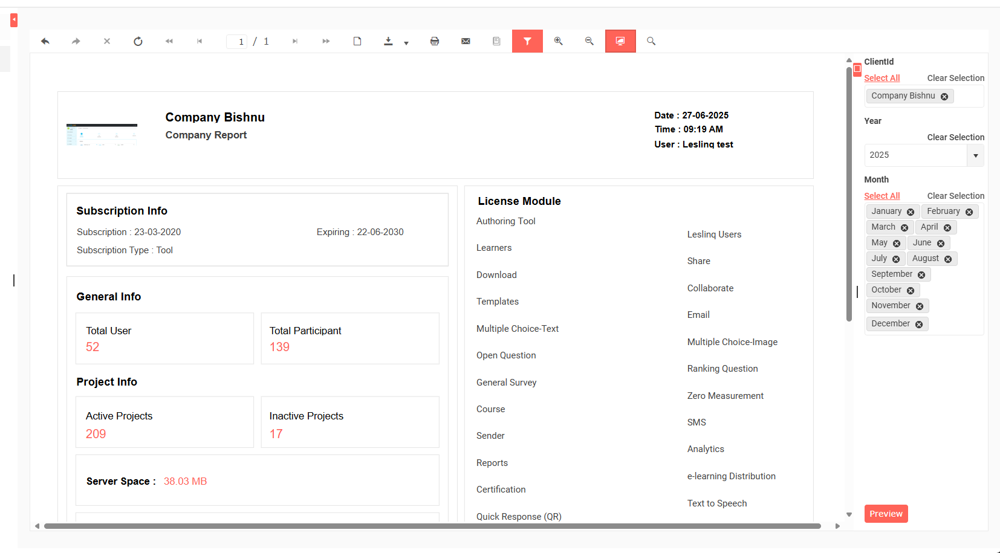
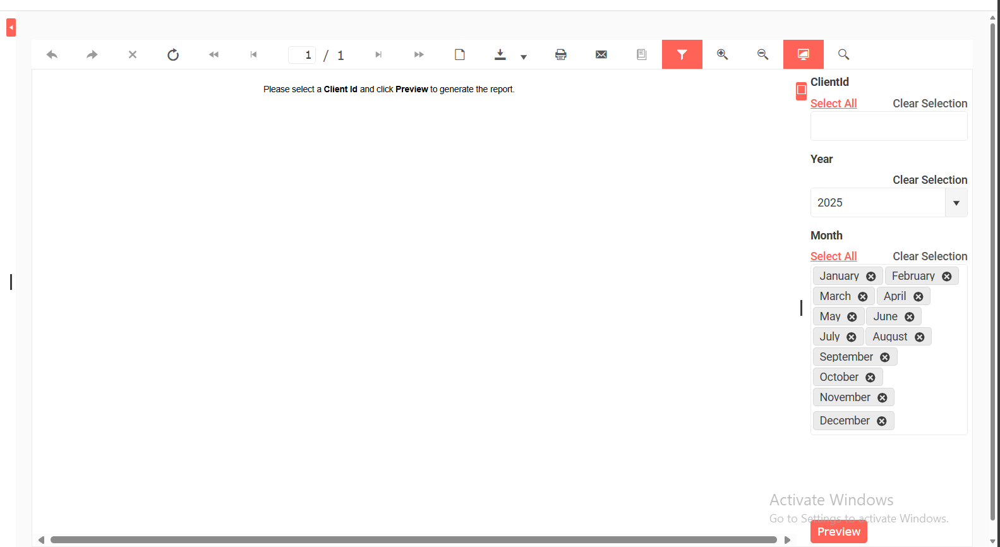
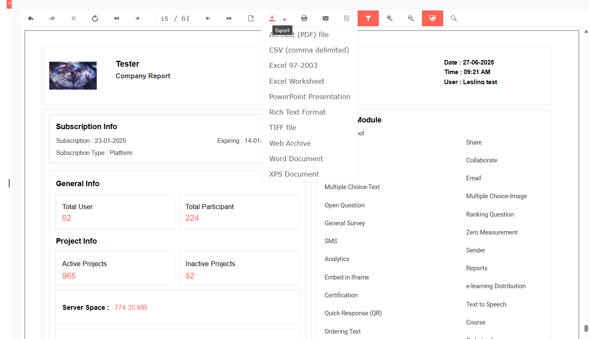
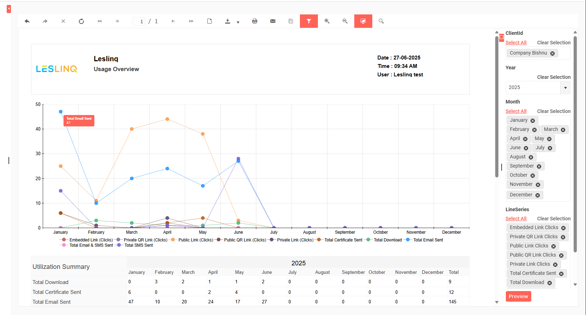
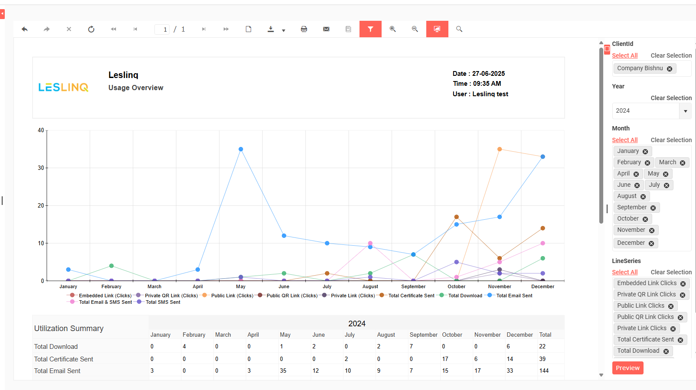
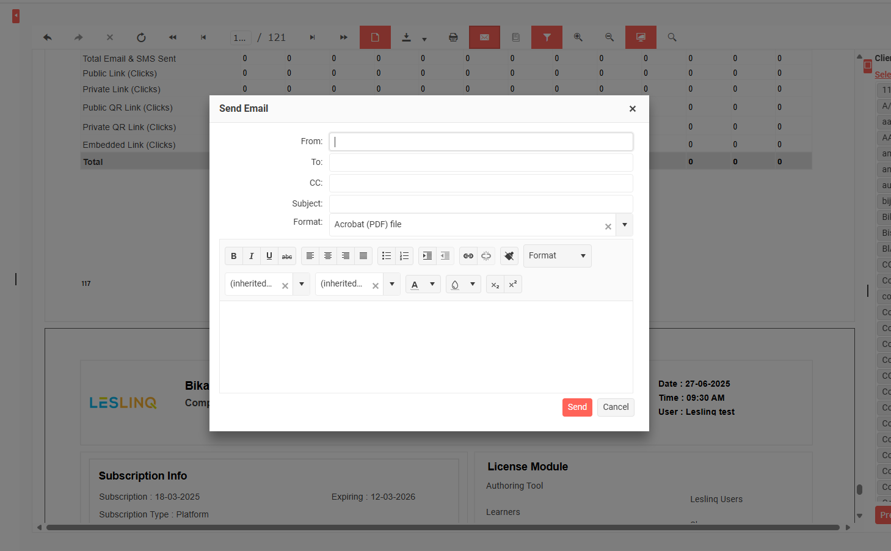
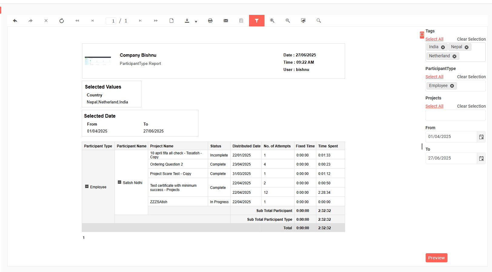
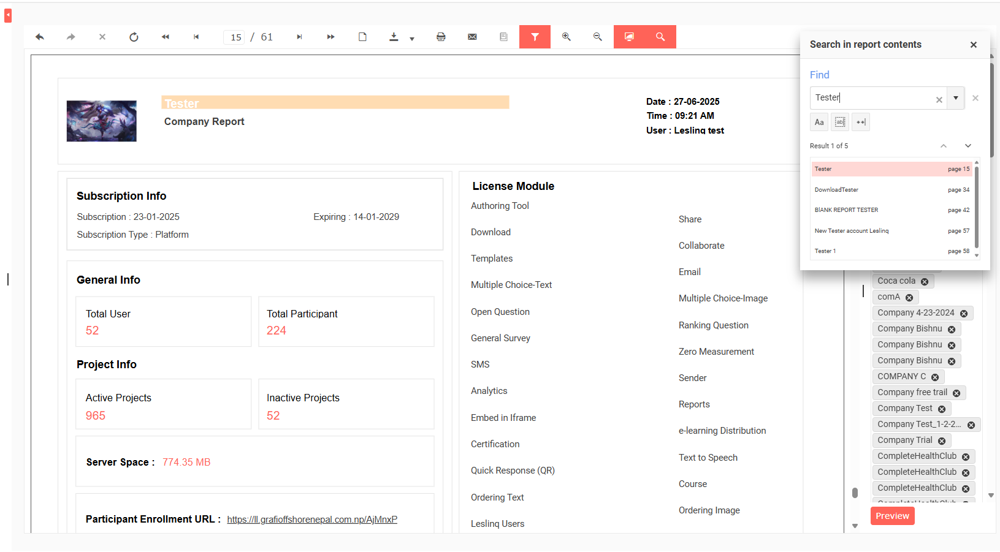

# 📊 Leslinq Telerik Reporting 📈

> **End-to-end reporting solution built for Leslinq using**  
> **ASP.NET MVC, Web API, Telerik Report Designer, and Telerik Report Server**

## 🚀 Overview
This project showcases a comprehensive **reporting solution for Leslinq**, integrated into an **ASP.NET MVC application** with **Web API controllers** for dynamic, secure data delivery.

Utilized **Telerik Reporting tools** to design, deploy, and manage multiple advanced reports, providing clients with actionable insights and interactive visualizations.

## ✨ Features
✅ **Integrated via ASP.NET MVC + Web API Controllers**  
   • Reports consume secure local API endpoints for dynamic data.

✅ **Multiple Reports Designed:**
- 🏢 **Company Report:**  
  Overview of company stats — user & participant counts, active/inactive projects, server space, subscription details, plus a crosstab utilization summary by company & year.

- 📈 **Usage Overview Report:**  
  Interactive line charts showing utilization metrics by month/year.  
  Toggle series visibility directly in the chart.

- 👤 **ParticipantType Report:**  
  Participant-wise project engagement: attempts, completion times, status — filtered by company.

✅ **Powerful Export & Distribution:**  
- Download as PNG, Excel, Word, PDF and more.  
- Email directly from the Telerik Report Viewer.

✅ **Multi-Environment Deployment:**  
- Managed across **development, staging, and production environments** using Telerik Report Server.

✅ **Client Enablement:**  
- Trained clients to customize & run reports independently via the Telerik Report Designer UI.

## 📸 Screenshots

